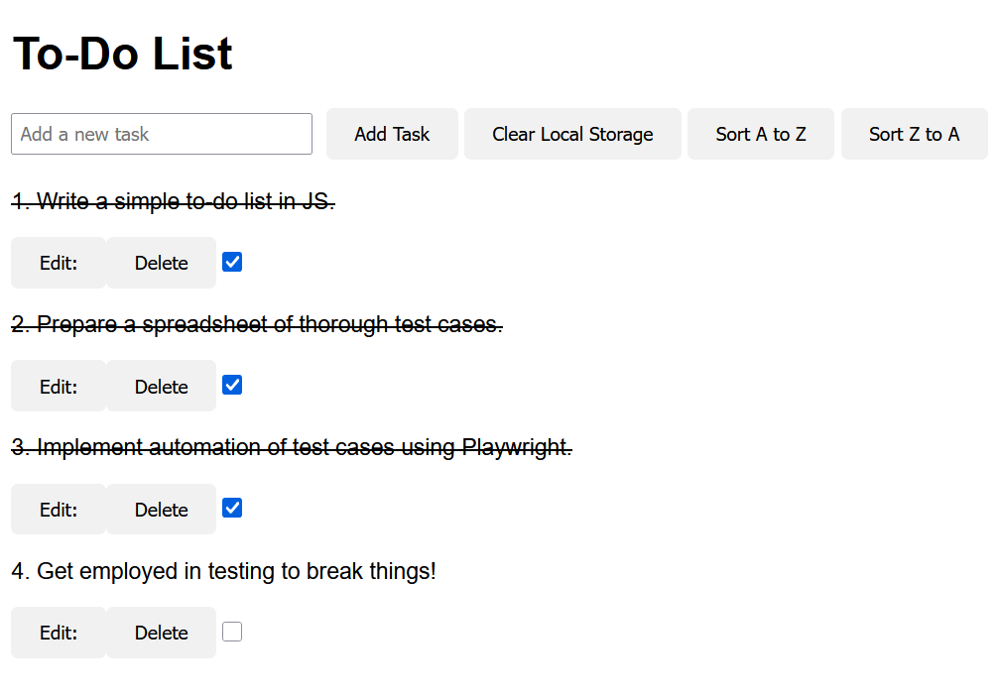
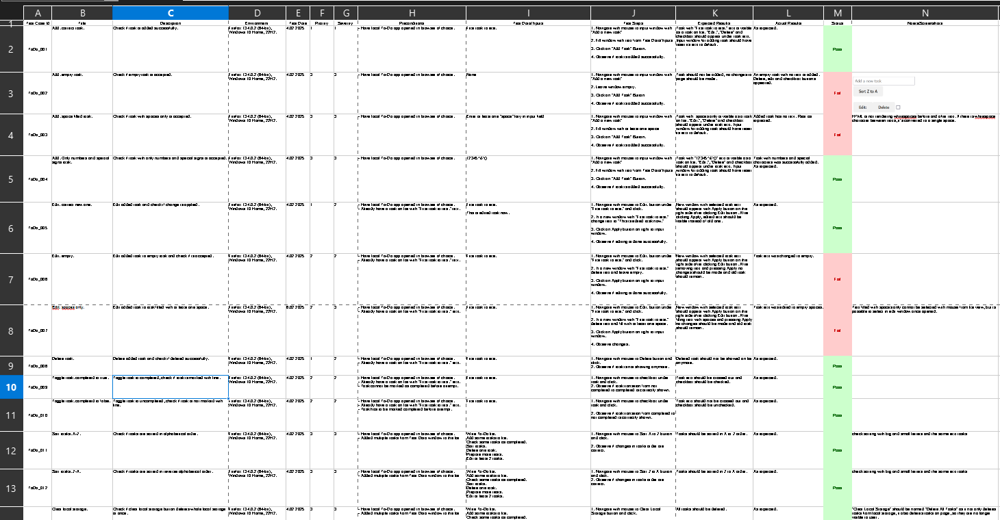

# To-Do List

Simple web app created to practice writing test cases and automating them using Playwright.

https://pawelmroczkowski.github.io/To-Do-List/

## Test cases for manual testing

This repository contains a spreadsheet with test cases that focused on verifying the following functionalities:

- Adding tasks to the list.
- Editing tasks.
- Deleting tasks.
- Sorting tasks A-Z, Z-A.
- Clearing local storage with a button.

The spreadsheet can be found here: [Test Case Sheet.ods](https://github.com/PawelMroczkowski/To-Do-List/raw/refs/heads/main/Test%20Cases/Test%20Case%20Sheet.ods)

## Automated Playwright tests

The tests were written based on test cases from spreadsheet above.

- [add-task.spec.js](Testing/test-case-automation/add-task.spec.js)

  - ToDo_001 Add task: correct.
  - ToDo_002 Add task: empty.
  - ToDo_003 Add task: space filled task.
  - ToDo_004 Add task: numbers and specials.

- [delete-and-completed.spec.js](Testing/test-case-automation/delete-and-completed.spec.js)

  - ToDo_008 Delete task.
  - ToDo_009 Toggle task: completed to true.
  - ToDo_010 Toggle task: completed to false.
  - ToDo_014 Delete: same id task.

- [edit-task.spec.js](Testing/test-case-automation/edit-task.spec.js)

  - ToDo_005 Edit: correct data.
  - ToDo_006 Edit: empty.
  - ToDo_007 Edit: spaces only.

- [sort-and-clear.spec.js](Testing/test-case-automation/sort-and-clear.spec.js)

  - ToDo_011 Sort tasks: A-Z.
  - ToDo_012 Sort tasks: Z-A.
  - ToDo_013 Clear Local Storage.

- [local-storage-tests.spec.js](Testing/test-case-automation/local-storage-tests.spec.js)

  - ToDo_015 Local storage checking.

    Steps:

    - Check if initial number of tasks is correct
    - Add task and check changes
    - Edit
    - Sort A-Z
    - Checking A-Z order
    - Toggle completed
    - Sort Z-A
    - Checking Z-A order
    - Delete
    - Toggle not completed
    - Clear local storage
